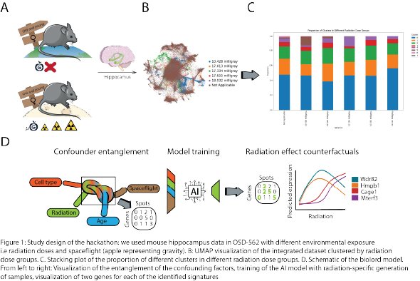

# SpAIce b.io



Space exploration offers unprecedented opportunities to expand our understanding of the universe but also poses unique risks to human health. Prolonged exposure to microgravity, increased radiation, and confined living spaces lead to significant physiological changes, affecting the musculoskeletal, neuronal, and immune systems. As humanity plans longer missions like Mars exploration, understanding spaceflight’s biological effects is crucial for astronaut safety and long-term space travel. Space research is constrained by limited sample sizes and complex logistics, emphasizing the need for alternative methods to estimate exposure risks. By analyzing transcriptional changes using [NASA GeneLab’s open-access data (OSD-562)](https://osdr.nasa.gov/bio/repo/data/studies/OSD-562) and incorporating radiation and microgravity levels, we developed a machine learning model to predict sample reactions to these variables. This approach helps identify commonalities with Earth diseases and potential preventive measures. Given the challenges of providing medical care in space, it is essential to determine in advance which medications would be most effective for astronauts during missions, ensuring their health and well-being.


## File descriptions
- **cellranger_array_job.slurm**: Pipeline submitted to SLURM job scheduler to process reads
- **environment_full.yml**: conda environment used during the hackathon
- **ESAHackathon_GraphicalAbstract_v3.png**: Graphical abstract
- **biolord_model**: trained disentanglement model
- **scvi_model**: trained integration model
- **preprocessing**: outputs realted to notebook 02_OSD-562_Preprocessing.ipynb
- **scvi**: outputs related to notebook 03_OSD-562_Integration.ipynb
- **enrichment_results**: outputs related to notebook 04_OSD-562_DataExploration.ipynb
- **gam**: outputs related to notebook 06_OSD-562_GAM.ipynb
     - <u>gam_models.pkl </u>: Pickle object containing the trained models for each gene
     - <u>y_test_dict.pkl </u>: Predicted gene expression along 50 linearly spaced radiation levels for each gene
     - <u>x_test_dict.pkl </u>: Linearly spaced radiation levels used for prediction
     - 
- **notebooks**: notebooks used to generate the figures presented in the manuscript

# Installing required packages

To replicate our results you will need to install the conda environment we used throughout the hackathon. Keep in mind that we used GPU acceleration to train the models, so make sure that you install GPU versions of Pytorch and scvi-tools.

```bash
conda env create -f environment_full.yml
```

# Using the trained models

If you want to use the models for your own research you will need the HVG-filtered matrix we trained these on as well as the intermediate files. These are available upon request. 


``` python
import os
import scvi
import scanpy as sc

adata = sc.read_h5ad("adata.h5ad")
scvi_model = scvi.model.SCANVI.load("scvi_model", adata=adata)
```

For the biolord model we recommend using the pre-trained model as it is computationally expensive. When loading the model make sure to transfer it to CPU and allocate at least 64Gb of RAM. 

``` python
import scvi
import scanpy as sc
import biolord

adata = sc.read_h5ad("adata.h5ad")
biolord.Biolord.setup_anndata(
    adata,
    categorical_attributes_keys=['age', 'spaceflight', 'leiden', 'radiation'],
)
module_params = {
    "decoder_width": 1024,
    "decoder_depth": 4,
    "attribute_nn_width": 512,
    "attribute_nn_depth": 2,
    "n_latent_attribute_categorical": 16,
    "n_latent_attribute_ordered": 16,
    "gene_likelihood": "nb",
    "reconstruction_penalty": 1e2,
    "unknown_attribute_penalty": 1e1,
    "unknown_attribute_noise_param": 1e-1,
    "attribute_dropout_rate": 0.1,
    "use_batch_norm": False,
    "use_layer_norm": False,
    "seed": 42,
}
model = biolord.Biolord(
    adata=adata,
    n_latent=32,
    model_name="spaceflight_radiation",
    module_params=module_params,
    train_classifiers=False,
)
model.load('biolord_model.pt', adata = adata, accelerator='cpu')
```

